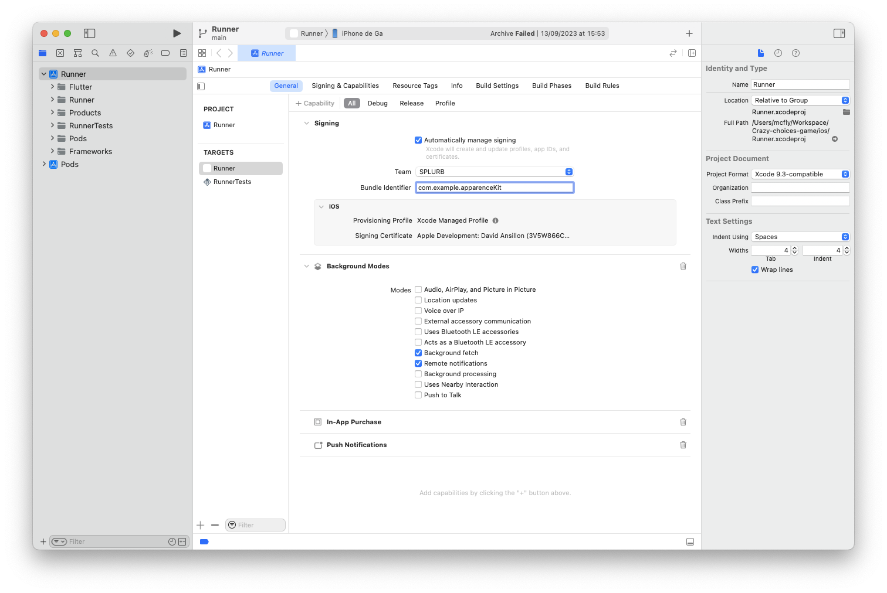
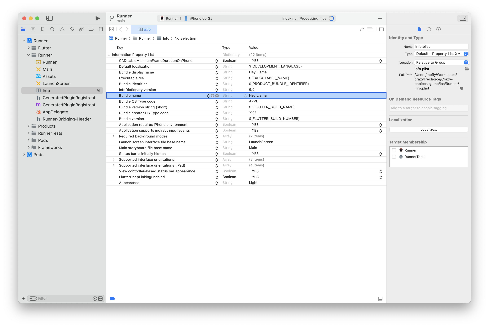

# Prepare for deployment

Before deploying your app you must first configure your app for production.

## Android

You must choose a package name and bundle identifier for your app.
ex: `com.example.myapp`

Avoir spaces and special characters in the package name and bundle identifier.
Both Apple and Google recommend using reverse domain name notation for your package name and bundle identifier.

Run this command to change the package name and bundle identifier:

```bash
dart run change_app_package_name:main com.example.myapp
```
**Change `com.example.myapp` with yours.**

### Change App display name

You can change the app display name in the `AndroidManifest.xml` file like this:

- 1. Open the `AndroidManifest.xml` file in the `android/app/src/main` folder.
- 2. Change the `android:label` value to your app name.

## iOS

You must use Xcode to configure your app for production.

If you use VSCODE:<br>
Right click on iOS folder and click on `Open in Xcode`.<br>
1. Click on Runner
2. Click on Targets > Runner
3. Change the bundle identifier



You can use the same bundle identifier for both Android and iOS.<br>
Bundle identifier must be unique for each app in the App Store and Google Play Store.

### Change App display name

You can change the app display name in the `Info.plist` file like this:



- change the `CFBundleDisplayName` or bundle name value to your app name.
- change the `CFBundleName` or bundle display name value to your app name.


