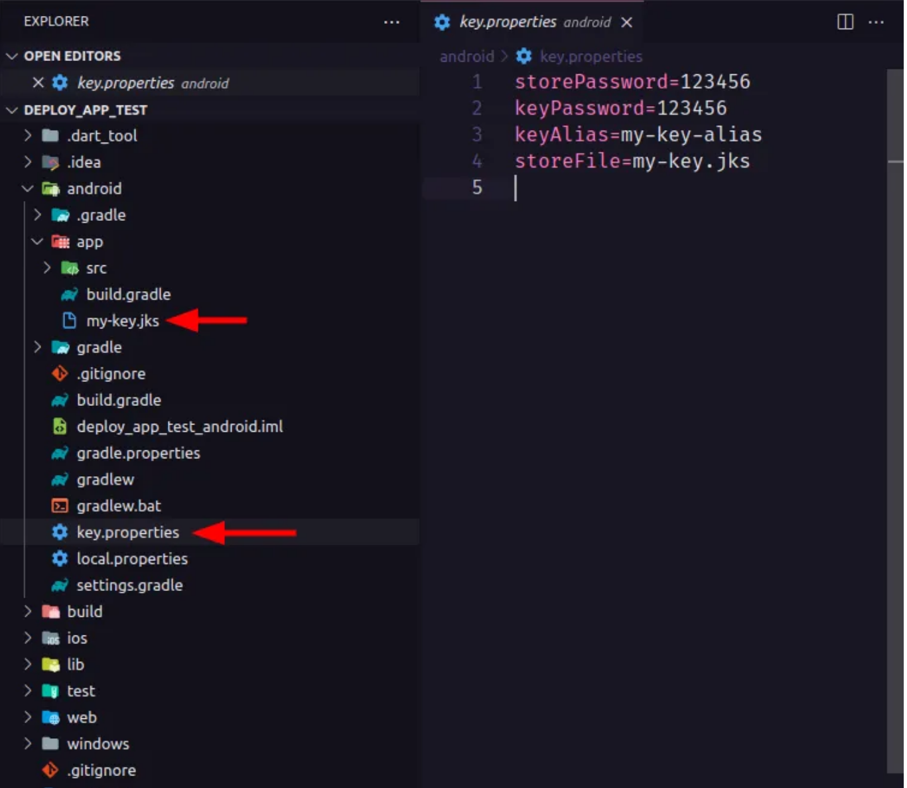

# Deploy Android app on Google Play Store

Let's see how to deploy your Android app on the Google Play Store.

## Generate a key sign your Android app

You must first generate a key to sign your Android app. This key will be used to sign all your future versions of your app.

**Don't lose it, otherwise you won't be able to update your app anymore.**

```bash
keytool -genkey -v -keystore ~/my-key.jks -keyalg RSA -keysize 2048 -validity 10000 -alias my-key-alias
```

## Create a keystore.properties file

Create a file named `keystore.properties` in the `android` folder of your project.

```properties
storePassword=YOUR_STORE_PASSWORD
keyPassword=YOUR_STORE_PASSWORD
keyAlias=my-key-alias
storeFile=my-key.jks
```

*Of course you must replace the values with your own...*
For security reasons, it is recommended to use environment variables to store your passwords.
Store your key in a safe place, as you will need it to update your app. Never put this in a public repository.

Your `android` folder should look like this:


## Configure your app

Open the `android/app/build.gradle` file and add the following lines:

```groovy
// [...]

def keystoreProperties = new Properties()
def keystorePropertiesFile = rootProject.file('key.properties')
if (keystorePropertiesFile.exists()) {
   keystoreProperties.load(new FileInputStream(keystorePropertiesFile))
}

android {
 // [...]

	signingConfigs {
      release {
         keyAlias keystoreProperties['keyAlias']
         keyPassword keystoreProperties['keyPassword']
         storeFile keystoreProperties['storeFile'] ? file(keystoreProperties['storeFile']) : null
         storePassword keystoreProperties['storePassword']
      }
   }   
	buildTypes {
      release {
				signingConfig signingConfigs.release
			}
   }
}

// [...]
```

## Generate the Executable file 

Run this command to generate the AppBundle file:

```bash
flutter build appbundle --release \
--dart-define=BACKEND_URL=https://us-central1-apparencekit-pro.cloudfunctions.net/app \
--dart-define=ENV=dev
```

If you have setup flavors, you can run this command

```bash
flutter build appbundle --release --flavor <flavor_name> \
--dart-define=BACKEND_URL=https://us-central1-apparencekit-pro.cloudfunctions.net/app \
--dart-define=ENV=dev
```

Don't forget to add all your environment variables. 
**That's one of the reasons I encourage you to use a CI to build your app.**

AppBundle are like Zip files containing all the resources of your app. It is the format required by the Google Play Store to be able to deploy your app.
You can also build an APK directly to test your app on your phone.

But don't send an APK to the Google Play Store. Send an AppBundle instead.

## Create a Google Play Store account

You must have a Google Play Store account to be able to deploy your app.
To create an account, go to the following link: [Google Play Console](https://play.google.com/apps/publish/signup/)

## Create a new application

Once your account is created, you can create a new application.
Now you can fill in the information about your app and drag and drop the AppBundle file you generated earlier into a production or test release.

## Pushing an update

You must increment the version number of your app in the `pubspec.yaml` file.
Then you can generate a new AppBundle file and upload it to the Google Play Store.

like this 
    
```yaml 
version: 1.0.0+1
```

```yaml 
version: 1.0.0+2
```

Note: Flutter encourage you to use the [Semantic Versioning](https://semver.org/) to manage your app version.

Then you can run the build command again
