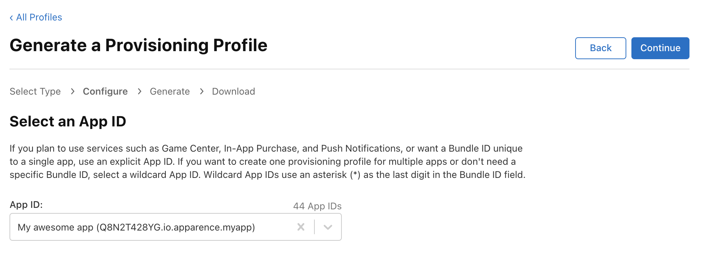

# Introduction

Signing an iOS app is an important process that guarantees the app originates from the developer and has not been modified since publication. Signing uses a **digital certificate** to associate the app with its developer and to **verify the integrity** of the app.

**Without a valid signature, the application cannot be installed or run on an iOS device.**

# Prerequisites

It's important to note that if you don't have a paid account for the Apple Developer Program, you **will not** be able to distribute your apps on the App Store, and you **will not** be able to take advantage of advanced development features (such as iOS app signing).

# Create a certificate 

The certificate is a file that allows you to **sign** your application and thus to **deploy** it on an iOS device. It is created as part of Apple's developer program and must be **renewed** regularly to continue to be used.

To create a certificate you have to follow this official guide [Creating Certificates for iOS Devices | Apple Developer Documentation](https://developer.apple.com/help/account/create-certificates/create-a-certificate-signing-request).

1. In [Certificates, Identifiers & Profiles](https://developer.apple.com/account/resources), click Certificates in the sidebar.

2. On the top left, click the add button (+).

3. Under Software, select Developer ID, then click Continue.

Developer ID Application: A certificate used to sign a Mac app.

Developer ID Installer: A certificate used to sign a Mac Installer Package, containing your signed app.

4. Follow the instructions to create a certificate signing request.

5. Click Choose File.

6. In the dialog that appears, select the certificate request file (a file with a .certSigningRequest file extension), then click Choose.

7. Click Continue.

8. Click Download.

The certificate file (a file with a .cer file extension) appears in your Downloads folder.

To install the certificate in your keychain, double-click the downloaded certificate file. The certificate appears in the My Certificates category in Keychain Access.


# **Create an app identifier**

Un identifiant d’application permet **d'identifier** de manière **unique** l'application et son développeur.

Voici comment créer un identifiant d’application:

1. Go on that link [Certificates, Identifiers & Profiles - Apple Developer](https://developer.apple.com/account/resources/identifiers/list).
2. Then click on the blue "+" button to add a new unique identifier.
    
    
    
3. Then select "App IDs", and click on "Continue".
    
    
    
4. Select the corresponding app ID type, i.e. "App", then click on "Continue".
    
    
    
5. On the next page, you'll need to fill in several fields:
    1. **Description:** A short description of the application identifier.
    2. **Bundle ID:** The application's unique identifier, usually **io.apparence.<appname>** (e.g. *io.apparence.monsuividiet*). Avoid capitalization, spaces and underscores/dashes.
    3. **Capabilities:** Application-related capabilities **can be updated later**, so you can leave them unchecked at first.
        
        
        
6. Then click on "Continue" and finally on "Register" to save the app ID.

The app ID is now created! Now we can move on to creating a provisioning profile.

# **Create a provisionning profile manually**

A provisioning profile on iOS is a file that allows you to **deploy** an application on an iOS device for **testing** or for **limited distribution** to specific users. The provisioning profile is associated with a digital certificate and a unique application ID (which we created earlier), and **guarantees** that the application is distributed by a trusted developer.

It is created as part of Apple's developer program and must be **renewed** regularly to continue to be used.

1. Go to the following link [Certificates, Identifiers & Profiles - Apple Developer](https://developer.apple.com/account/resources/profiles/list)
2. Then click on the blue "+" button to create a new profile.
    
    
    
3. We'll now need to choose the type of our provisioning profile (we'll only develop the types for iOS).
    1. ****iOS App Development:**** If you want to deploy an application for development on **test devices** (i.e. on a real phone for development directly connected to Xcode, for example).
    2. ****Ad Hoc:**** To deploy an application to a limited number of devices (mainly used for beta applications such as Firebase App Distribution or TestFlight).
    3. ****App Store:**** Used to deploy an application to the **AppStore** and thus to an unlimited number of devices.
4. In this tutorial, we'll select "Ad Hoc" and then click on "Continue" in the top right-hand corner.
    
    
    
5. In the next step, you'll need to select the app ID we created earlier from the list. Then click on "Continue".
    
    
    
6. The next step is to select the certificate that will be associated with the provisioning profile. Here we'll choose the "**SPLURB (Distribution)**" certificate with the **farthest expiry date**. Then click on "Continue".
    
    
    
7. In this new screen, you are invited to select **the devices** that will be eligible to **install** and **launch** the application (this step is not necessary for an AppStore provisioning profile). Then click on "Continue".
    
    
    
8. Then give the provisioning profile a name. In general, we use the following nomenclature: "**<TYPE>** - *<NAME APP>*"
        
        
9. Now click on “Generate”.

The provisioning profile is now **generated**. Note that you don't need to download it locally to your computer, as we'll be able to do this **directly from Xcode** in the next step.

# Download the provisioning profile

Now that the provisioning profile is created, we'll need to download it to our computer.

> **Important: This step is important because the automatic download still doesn't work with Flutter when building iOS…**
> 

It's also important to perform this operation on the **machine that will sign the application**, i.e. at Apparence, the **iMac** that acts as the **CI** (it can be accessed via **screen sharing** or **physical**).

1. Open Xcode, then click on the context menu, then "Settings".
    
    
     
2. Now click on download profiles then wait a little

The provisioning profile has now been successfully downloaded and is ready for use.

# **Sign your iOS app**

It's now possible to sign your application, and in this tutorial we'll look at how to do it from within Xcode and then via Flutter on the command line.

## Flutter (CLI)

Run this command
```bash
flutter build ipa --release \
--dart-define=BACKEND_URL=https://us-central1-apparencekit-pro.cloudfunctions.net/app \
--dart-define=ENV=dev
```

If you have setup flavors, you can run this command
```bash
flutter build ipa --release --flavor <flavor_name> \
--dart-define=BACKEND_URL=https://us-central1-apparencekit-pro.cloudfunctions.net/app \
--dart-define=ENV=dev
```

Don't forget to add all your environment variables. 

That's one of the reason I encourage you to use a CI to build your app.

You will find the result ipa in the build/ios/ipa/[APP_NAME].ipa

# Publish your app on the App Store

1. Connect on Apple Connect [App Store Connect (apple.com)](https://appstoreconnect.apple.com/apps).
2. Click on the “+” blue button, then “New app”.
    
    
    
3. Select the platform (iOS, tvOS, etc.) for which you want to publish your application.
4. Enter basic application information, including name, description, screenshots and icon.
    
    
    
5. Download the "Transporter" application on the [Mac AppStore](https://apps.apple.com/fr/app/transporter/id1450874784?mt=12).
6. Signin with your Apple ID.
7. Click on "Add an app" or drag and drop the IPA file into the window below.
8. Click on "Deliver" and wait for the upload to finish.

Note: Apple process your app before you can submit it to the App Store. This can sometimes takes hours or just minutes.
Once the process is done, you can submit your app to the App Store.

## Pushing an update

You must increment the version number of your app in the `pubspec.yaml` file.
Then you can generate a new AppBundle file and upload it to the Google Play Store.

like this 
    
```yaml 
version: 1.0.0+1
```

```yaml 
version: 1.0.0+2
```

Note: Flutter encourage you to use the [Semantic Versioning](https://semver.org/) to manage your app version.

Then you can run the build command again